# Equilibra - WebApp de Controle Calórico

## Descrição
O **Equilibra** é um aplicativo multiplataforma (Android, iOS e Web) desenvolvido para auxiliar no **controle da ingestão calórica e nutricional**.  
Ele ajuda pessoas a **monitorar seus hábitos alimentares**, com foco especial em quem convive com **obesidade, diabetes, hipertensão** e outras condições relacionadas à saúde alimentar e metabólica.  

A proposta é ser uma solução **prática, intuitiva e acessível**, que auxilie os usuários a tomarem decisões alimentares mais conscientes no dia a dia.

---

## Funcionalidades
- Registro de refeições e cálculo automático de calorias e nutrientes (sódio, gorduras, açúcares, carboidratos).  
- Escaneamento de **códigos de barras e QR Codes** para identificar informações nutricionais.  
- Integração com a **API Open Food Facts** (base de dados pública de alimentos).  
- Alertas personalizados de acordo com restrições de saúde (ex: diabetes, hipertensão).  
- Funcionamento **offline** (armazenamento local).  
- Relatórios e gráficos para acompanhamento da evolução alimentar.  
- Filtros e preferências (ex.: dieta low carb, vegana, sem lactose, sem glúten).  

---

## Tecnologias Utilizadas
- **Frontend**:
- Framework HTML: W3.CSS (https://www.w3schools.com/w3css/)
-  Biblioteca de gráficos: Chart.JS (https://www.chartjs.org).
- **Backend**:
- Node.JS + Hapi.JS (https://hapi.dev)
- **Banco de Dados**: Banco de dados: SQLite (https://www.npmjs.com/package/sqlite3) 
- **APIs**: API de Terceiros: OpenFoodFacts (https://openfoodfacts.github.io/openfoodfacts-server/api/) 
- **Design**: UI/UX focada em simplicidade e acessibilidade
  

---

## Objetivos
- Oferecer uma ferramenta que **auxilie os usuários** a monitorar e controlar seus hábitos alimentares.  
- Garantir **simplicidade**, para qualquer pessoa usar facilmente.  
- Proporcionar uma experiência **intuitiva e acessível**, independente do dispositivo.  
- Contribuir para a **prevenção de doenças crônicas** relacionadas à alimentação.  

---

## Personas

### Marcos Ribeiro
- **Idade**: 48 anos | **Profissão**: Motorista de aplicativo | **Local**: Salvador, BA  
- Vive com diabetes tipo 2, tem rotina corrida e alimentação irregular.  
- Usa o Equilibra para monitorar sua alimentação e receber **alertas personalizados** sobre glicemia.  

### Dra. Fernanda Lopes
- **Idade**: 42 anos | **Profissão**: Nutricionista clínica | **Local**: Curitiba, PR  
- Usa o app para analisar relatórios dos pacientes e otimizar o tempo na elaboração de dietas.  

### Dr. André Teixeira
- **Idade**: 39 anos | **Profissão**: Psicólogo clínico | **Local**: Recife, PE  
- Especialista em transtornos alimentares, utiliza o Equilibra como apoio na psicoterapia para identificar padrões emocionais ligados à alimentação.  

---

## Jornada do Usuário

- **Marcos (motorista)** → Escaneia alimentos no mercado, recebe alerta de alto teor de açúcar, substitui por opção saudável sugerida pelo app.  
- **Fernanda (nutricionista)** → Recebe gráficos da dieta dos pacientes, monta planos personalizados e acompanha remotamente sua evolução.  
- **Dr. André (psicólogo)** → Usa os registros do app como base em sessões terapêuticas para discutir padrões de compulsão alimentar.  

---

##  Protótipo / Telas

## Vídeo

Aqui está o vídeo de demonstração (menos de 1 minuto):

https://drive.google.com/file/d/1GJvP2v64705Y-kKxQlKIJ3N6NT3A3Hc2/view?usp=drive_link

Além disso um vídeo com demonstração de gráficos e relátorios.(https://drive.google.com/file/d/18H0Sqk6EvCG0QSJKlOIqmOAxV_BBDqpa/view?usp=drive_link)

## GIFs de funcionalidades

### Registro

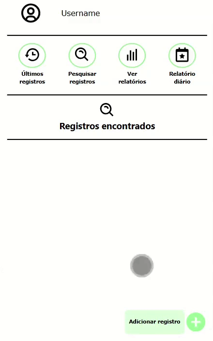
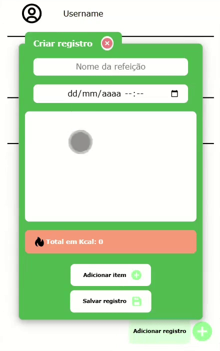
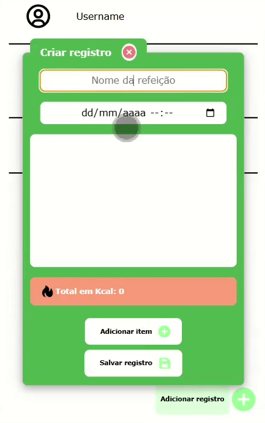
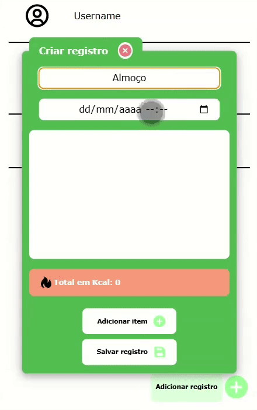

### Itens

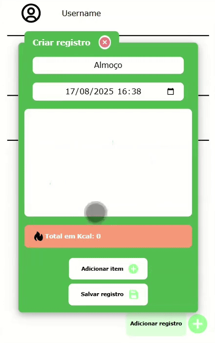
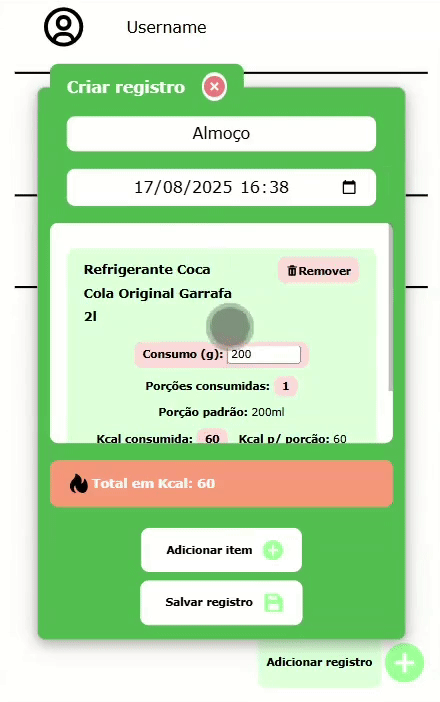
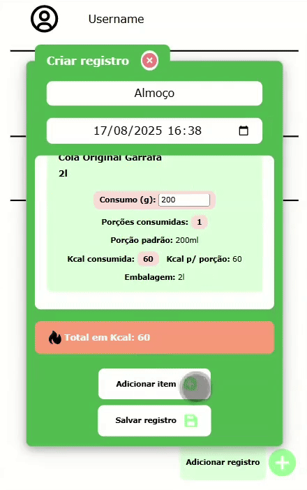
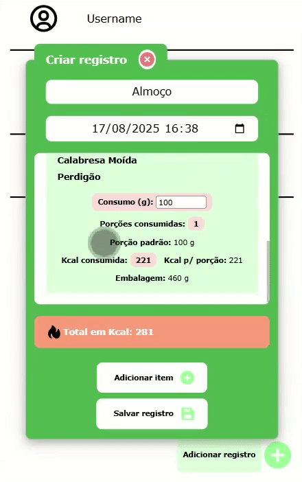

### Visualização

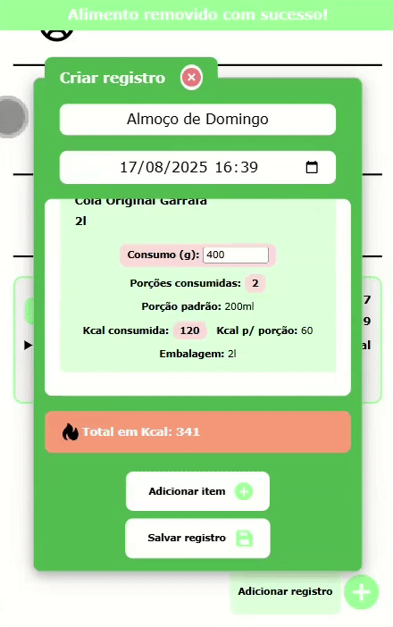
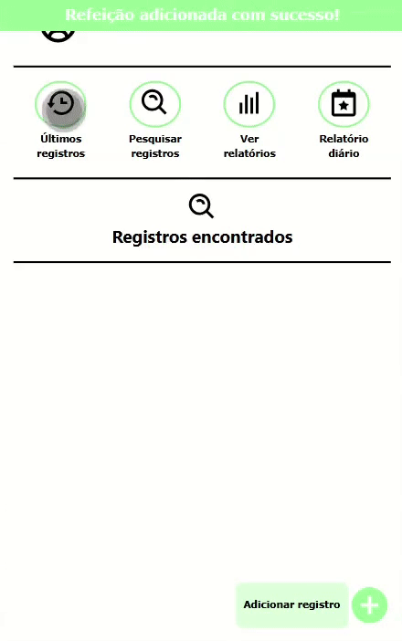
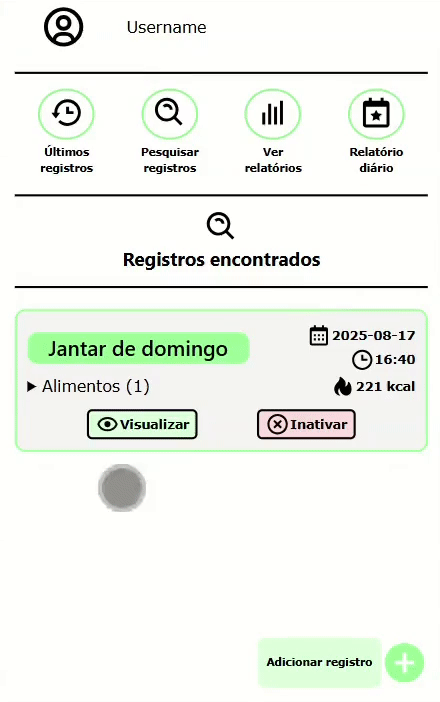

### Edição

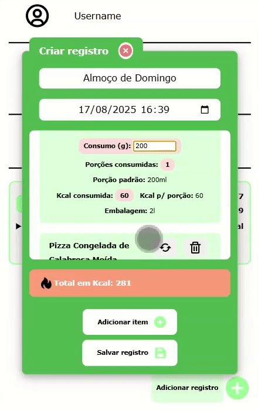
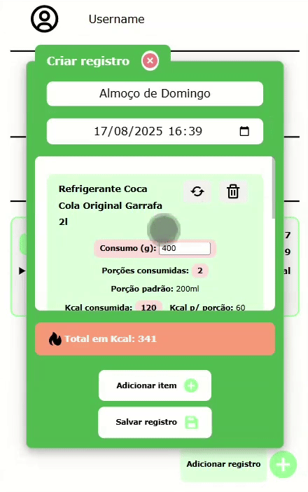
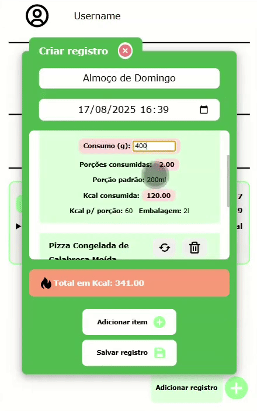
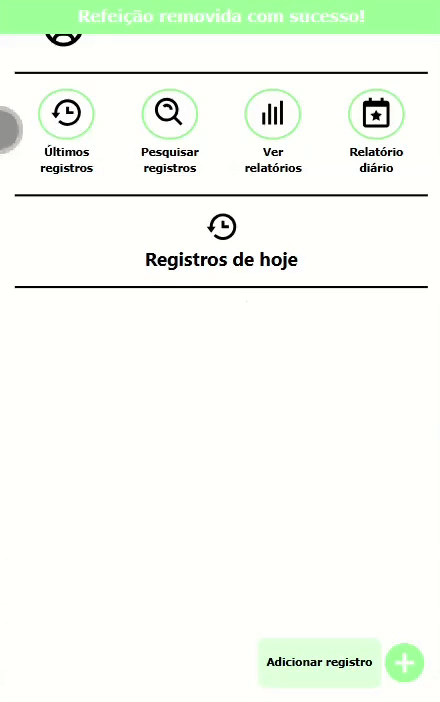
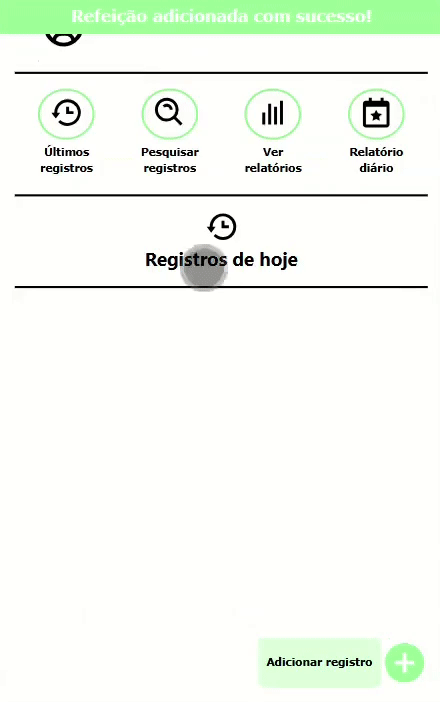

